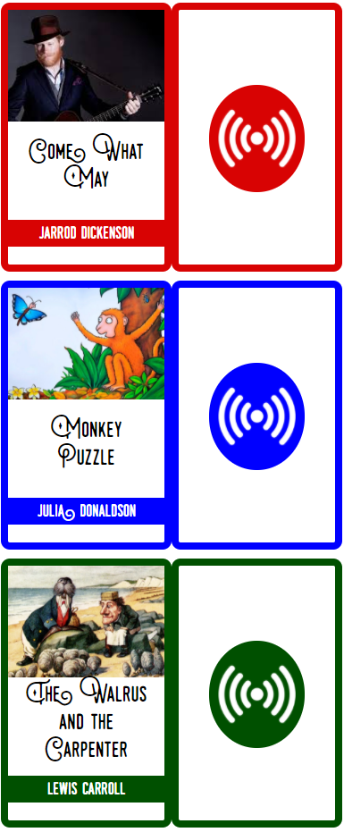

# NFC Card Generator
This project generates credit card sized cards that can be printed and laminated. My use case is to embed an nfc sticker and each card, when scanned, will trigger the associated audio file to play on a configured speaker (using [Tag Reader for Home Assistant](https://github.com/adonno/tagreader)  by @adonno).

Cards are rendered in a webpage using [AngularJS](https://angularjs.org/). The webpage is data driven from a JSON file so new cards can be added very easily. Note that when printed on A4 there will be 3 cards per page and each printed card is approx 8mm smaller than standard credit card dimensions (in both directions) to allow them to be laminated.

# Installation
1. Clone the repo
2. Start the Mongoose web server (in the root `nfc-cards` directory).
3. Open http://localhost:8080/index.html

## Optional
4. To limit the number of cards displayed, specify the `show` parameter on the URL querystring, e.g. http://localhost:8080/index.html!#show=3 (you may need to refresh the browser).

# Configuration
## Fonts
A custom font can be added to the `nfc-cards/fonts` folder. The following entry in `css/styles.css` should then be updated to reference the new font:
```
@font-face {
    font-family: monthoers;
    src: url('../fonts/Monthoers 2 Clean.otf');
}
```
**NB:** The font referenced in the checked-in stylesheet (and in the example cards below) is not provided in the repo due to licensing restrictions on this font file. A [free version](https://www.dafont.com/swistblnk-monthoers.font) of this font is available but doesn't include all of the ligatures.

## Colours
Additional styles can be added by duplicating this element in `css/styles.css`, changing the class name and colour.
```
.story {
    --highlight-color: #0000ff;
}
```

## Data
1. Edit `data.json` to create your own cards as a list of objects in the following format:
```
{
    "type": "poem",
    "title": "The Walrus and the Carpenter",
    "author": "Lewis Carroll",
    "image": "walrus_and_the_carpenter.png"
}
```
2. Add your image to the `nfc-cards/img/` folder.

# Styles
Each item in `data.json` can specify a `style` attribute which is used to set the highlight colour for the border and background of the "author" text and NFC logo on the card back.

The following styles can be specified:
* `music`
  * Red highlight
* `story`
  * Blue highlight
* `poem`
  * Green highlight
* `podcast`
  * Pink highlight

# Example
